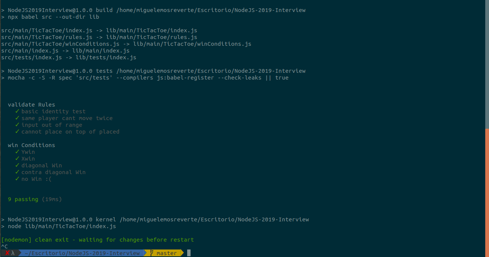

# NodeJS-2019-Interview

# [requirements](./requirements.pdf)
--------------
## instructions
###### INSTALL
npm install

###### RUN
npm run debug-kernel

--------------

<table>
    <tr>
    <td></td>
    <td></td>
    </tr>
</table>

</tr>

<table>
  <tr>
    <td></td>
    <td></td>
  </tr>
  <tr>
    <td></td>
    <td></td>
  </tr>
</table>

-------------
# #BTW

<table>
  <tr>
  <td><h5>FP</h5></td>
  <td><h5>TDD</h5></td>
  </tr>
  <tr>
  <td></td>
  <td></td>
  </tr>
</table>
